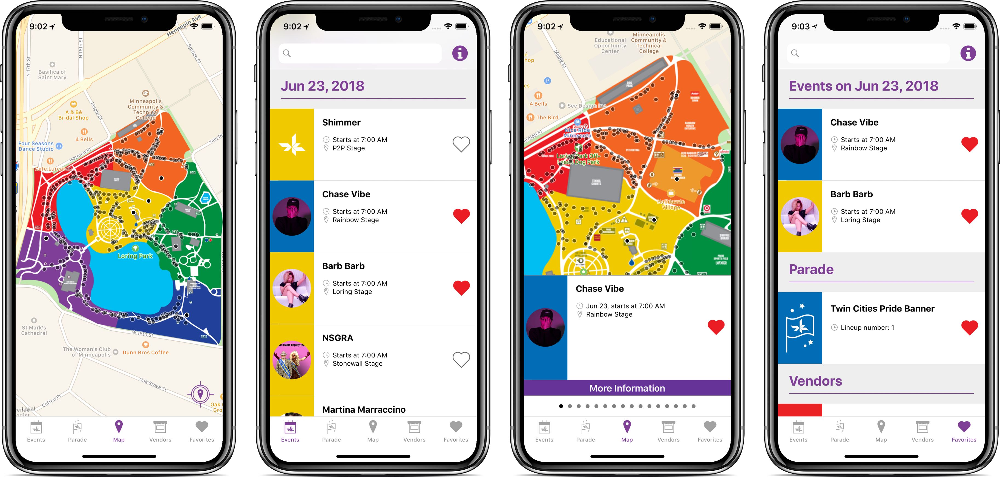

# Twin Cities Pride iOS

**Twin Cities Pride iOS** is a mobile application for the yearly [Twin Cities Pride](https://www.tcpride.org/) festival and parade. It is a native iOS app written in Swift 4.1. An Android version written in Kotlin is available [here](https://github.com/softwareforgood/pride-festival-android). The app downloads data from a [Parse Server](https://github.com/softwareforgood/pride-festival-parse) instance. It is persisted locally, so it can be viewed without internet connectivity.

## Features

- All Pride Festival events and vendors can be viewed in lists or on a map. 
- The full lineup of the Pride parade can be viewed in a list.
- Events, vendors, and lineups can be favorited for later.
- Easily get directions to an event.

## Getting started

1. Install [CocoaPods](http://cocoapods.org/).
2. Run `pod install` in the root folder of the repository.
3. Obtain the `fabric.apikey` file and place in the project root, or create an empty file `fabric.apikey`.
4. Optional: Obtain the `fabric.buildsecret` file and place it in the project root.
5. Open `PrideFestival.xcworkspace` in Xcode 9.4.
6. If you don't have a `fabric.buildsecret` file, run the `PrideFestivalStaging` target. Otherwise, you can run either target.

## Contributing

Software for Good welcomes open source contributions to the Twin Cities Pride iOS app. You can pull down the app code and run it as is. The app is configured to connect to our Parse Server instances to pull down data, so you don't need to run your own server. If you would like to make a change, fork this repository and submit a pull request.

Everyone interacting in this repository is expected to follow the [code of conduct](code-of-conduct.md).

### Targets

The Xcode project has two targets, `PrideFestival` and `PrideFestivalStaging`. The only difference between the two is which Parse Server they use, and the app icon. The server for `PrideFestival` contains production festival data, but after the festival this data may be outdated. The server for `PrideFestivalStaging` may contain more useful dummy data in this case. When creating new source code files, add them to both targets.

## Building your own Pride app

Forking this app to build your own Pride festival guide requies iOS development knowledge and running your own backend. [Contact us](https://softwareforgood.com/contact/) at Software for Good if you are interested in connecting with us to build a pride app for another Pride festival. 

## License

Twin Cities Pride iOS is released under the [MIT license](LICENSE).
